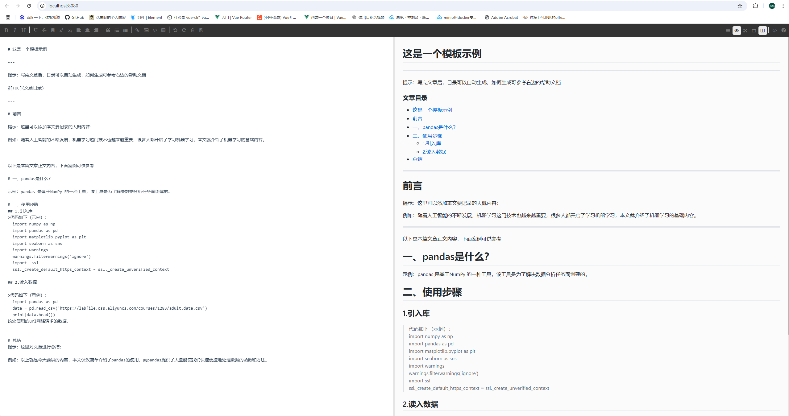

# markdown-editor

## 简单的markdown编辑器
可实现在在内部环境简单快捷的编写markdow文档


页面效果


***可直接部署在内部服务器上，仅需通过 ip:port 即可使用，非常方便***

## Project setup
```
npm install
```

### Compiles and hot-reloads for development
```
npm run serve
```

### Compiles and minifies for production
```
npm run build
```

### Lints and fixes files
```
npm run lint
```

### Customize configuration
See [Configuration Reference](https://cli.vuejs.org/config/).
